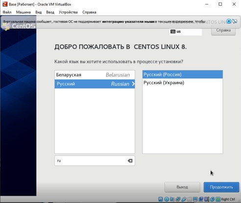

---
# Front matter
lang: ru-RU
title: 'Отчёт'
subtitle: 'по лабораторной работе 1'
author: 'Лекомцева Алёна'

# Formatting
toc-title: 'Содержание'
toc: true # Table of contents
toc_depth: 2
lof: true # List of figures
lot: true # List of tables
fontsize: 12pt
linestretch: 1.5
papersize: a4paper
documentclass: scrreprt
polyglossia-lang: russian
polyglossia-otherlangs: english
mainfont: PT Serif
romanfont: PT Serif
sansfont: PT Sans
monofont: PT Mono
mainfontoptions: Ligatures=TeX
romanfontoptions: Ligatures=TeX
sansfontoptions: Ligatures=TeX,Scale=MatchLowercase
monofontoptions: Scale=MatchLowercase
indent: true
pdf-engine: lualatex
header-includes:
  - \linepenalty=10 # the penalty added to the badness of each line within a paragraph (no associated penalty node) Increasing the value makes tex try to have fewer lines in the paragraph.
  - \interlinepenalty=0 # value of the penalty (node) added after each line of a paragraph.
  - \hyphenpenalty=50 # the penalty for line breaking at an automatically inserted hyphen
  - \exhyphenpenalty=50 # the penalty for line breaking at an explicit hyphen
  - \binoppenalty=700 # the penalty for breaking a line at a binary operator
  - \relpenalty=500 # the penalty for breaking a line at a relation
  - \clubpenalty=150 # extra penalty for breaking after first line of a paragraph
  - \widowpenalty=150 # extra penalty for breaking before last line of a paragraph
  - \displaywidowpenalty=50 # extra penalty for breaking before last line before a display math
  - \brokenpenalty=100 # extra penalty for page breaking after a hyphenated line
  - \predisplaypenalty=10000 # penalty for breaking before a display
  - \postdisplaypenalty=0 # penalty for breaking after a display
  - \floatingpenalty = 20000 # penalty for splitting an insertion (can only be split footnote in standard LaTeX)
  - \raggedbottom # or \flushbottom
  - \usepackage{float} # keep figures where there are in the text
  - \floatplacement{figure}{H} # keep figures where there are in the text
---

# Цель работы

Приобретение практических навыков установки операционной системы на виртуальную машину, настройки минимально необходимых для дальнейшей работы сервисов.

# Задание

Лабораторная работа подразумевает установку на виртуальную машину VirtualBox (https://www.virtualbox.org/) операционной системы Linux, дистрибутив CentOS.

# Выполнение лабораторной работы

1. Запускаю _Virtual Box_, создаю новую виртуальную машину с именем **_Base_**: выбираю тип операционной системы _Linux_, версия _Red Hat_ (рис.1).

   { #fig:001 width=60% }

2. Указываю объем памяти 1024 МБ (рис.2).

   { #fig:002 width=60% }

3. Задаю конфигурацию жесткого диска: создаю новый динамический виртуальный жёсткий диск типа VDI, а также размер диска - 40 ГБ и его расположение (рис.3-6).

   { #fig:003 width=60% }

   { #fig:004 width=60% }

   { #fig:006 width=60% }

   { #fig:007 width=60% }

4. Добавляю во вкладке _"Носители"_ свойств виртулальной машины новый привод оптических дисков, выбираю нужный образ для установки операционной системы (рис.7).

   { #fig:008 width=60% }

5. Запускаю созданную виртуальную машину и начинаю установку. В открытом окне выбираю русский язык как язык интерфейса, а также добавляю русскую раскладку клавиатуры (рис.8).

   { #fig:009 width=60% }

6. Задаю пароль для root пользователя (рис.9).

   { #fig:010 width=60% }

7. Продолжаю установку операционной системы, перезагружаю виртуальную машину по требованию установщика (рис.10-12).

   { #fig:011 width=60% }

   { #fig:012 width=60% }

   { #fig:013 width=60% }

8. Вхожу в созданный ранее профиль, открывается привычный графический интерфейс (рис.13).

   { #fig:014 width=60% }

9. Запускаю терминал, перехожу под учетную запись root с помощью команды _su_. С помощью команды _yum update_ обновляю системные файлы и установаю программу mc с помощью команды _yum install mc_ (рис.14-15) 

   { #fig:015 width=60% }

   { #fig:016 width=60% }

10. Для того чтобы другие виртуальные машины могли использовать машину Base и её конфигурацию как базовую, меняю тип жесткого диска «Base.dvi» на тип «с множественным подключением» (рис.16).

   { #fig:017 width=60% }

11. На основе виртуальной машины Base аналогичным образом создаю машину Host2, но теперь не создаю новый жесткий диск, а использую существующий созданный ранее Base.vdi (рис.17-18).

   { #fig:018 width=60% }

   { #fig:019 width=60% }
   
# Выводы

Я приобрела практические навыков установки операционной системы на виртуальную машину, настройки минимально необходимых для дальнейшей работы сервисов.
